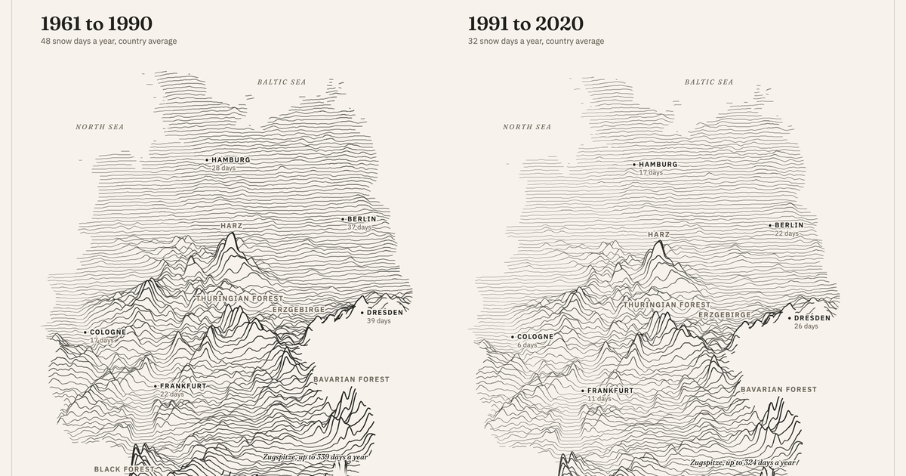

# Where did Germany's snow go?

Seventy-five years of snow in Germany, drawn as terrain. Data: Deutscher Wetterdienst, 1 km grids of snow cover days, 1951 to 2025.

## Open it

- [The poster](https://chiragsomashekar.github.io/snow-lines/). 1961 to 1990 next to 1991 to 2020. Point anywhere on a map to read a value.
- [How this was made](https://chiragsomashekar.github.io/snow-lines/?method). What is counted, every year as a bar, and nine weather stations against the map.

## Good to know

- A snow day is a morning with at least 1 cm of snow on the ground.
- One line every 6 km, north to south. More snow: higher and darker.
- The two periods are the ones the World Meteorological Organization uses. Any other pair of thirty-year periods gives the same answer: less snow.
- Every number on the pages is written by a script from DWD's files, and a check must pass before a build. `DATA.md` has the sources and the checks. `notebooks/the-check.ipynb` rebuilds the data from the raw files without any project code.

## Built with

React, D3 and Motion. Python for the data.

## Data

Deutscher Wetterdienst, Climate Data Center. Annual 1 km grids of snow cover days and the daily records of nine stations. Open data, CC BY 4.0. The code is MIT.
